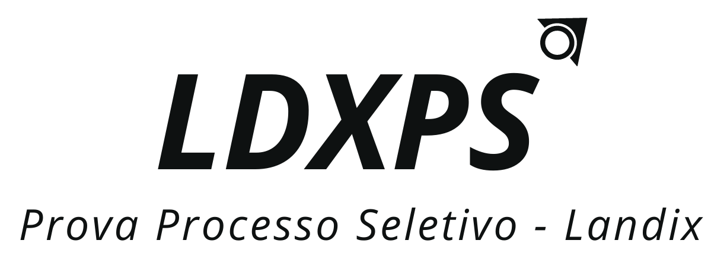

<h1 align="center">


<br />

</h1>

<h4 align = "center">
  LDXPS
</h4>

<p align="center">
  
  
  
  
  

  <a href="https://github.com/FLVieira/ldxps-processo-seletivo-landix/commits/master">
    
  </a>
  
  <a href="https://github.com/FLVieira/ldxps-processo-seletivo-landix/issues">
    
  </a>
  
  
</p>

<p align="center">
  <a href="#tecnologias-utilizadas">Tecnologias utilizadas</a> |
  <a href="#instalação-e-execução">Instalação</a> |
  <a href="#-licença">Licença</a>
</p>

Esta aplicação é a uma prova/exercício referente a 1º etapa do processo seletivo para vaga de Desenvolvedor Júnior/Estagiário na Landix. 
Para desenvolver todo o frontend foi usado a biblioteca/framework React, enquanto toda a lógica do backend foi feita com o NodeJS.

## 🎨 Layout 

Você pode utilizar a seguinte URL para visualizar todas as telas: [Visualizar](https://drive.google.com/drive/folders/1CwHfKHSPdT6JOzOk5hGsnl1py21DGT0W?usp=sharing)

## Instalação e execução

1. git clone https://github.com/FLVieira/ldxps-processo-seletivo-landix.git
2. cd ldxps-processo-seletivo-landix

### Backend /

```
# Acessar diretório 
$ cd gobarberbackend
```

#### Pré-requisitos:

Ferramentas -

- Yarn/Npm
- Docker

Serviços -

- Postgres

#### Instânciando uma imagem do banco de dados

> \$ sudo docker run --name ldxps -e POSTGRES_PASSWORD=1234 -p 5434:5432 -d postgres:11

#### Iniciando a aplicação

Depois de instânciar a base de dados podemos iniciar a api

1. Rodamos o comando yarn para fazer a instalação das dependências passadas no package.json

   > yarn

2. Executamos as migrations para criar as tabelas no banco de dados

   > yarn sequelize db:migrate
   
3. Populando a tabela de vendedores (sellers) no banco de dados 

   > yarn sequelize db:seed:all 

4. Iniciando a api

   > yarn dev

#### Rotas

Se tudo ocorreu bem até aqui significa que a api está rodando, agora, para poder testar as rotas dessa aplicação basta importar o arquivo insomnia.json dentro da 
raíz do repositório para o seu insomnia.

### Frontend /

```
# Acessar diretório 
$ cd frontend
```

Pré-requisitos:

- Backend da aplicação executando.


#### Iniciando a aplicação
```
# Vá no seu terminal e digite os seguintes comandos:
1. yarn ou npm i
2. yarn start ou npm start
```

## Tecnologias utilizadas

### Frontend

- [React](https://github.com/facebook/react)
- [Axios](https://github.com/axios/axios)
- [Styled-Components](https://github.com/styled-components/styled-components)
- [Eslint](https://github.com/eslint/eslint)

### Backend

- [cors](https://github.com/expressjs/cors)
- [helmet](https://github.com/helmetjs/helmet)
- [date-fns](https://github.com/date-fns/date-fns)
- [dotenv](https://github.com/motdotla/dotenv)
- [express](https://github.com/expressjs/express)
- [pg](https://github.com/brianc/node-postgres)
- [pg-hstore](https://github.com/scarney81/pg-hstore)
- [sequelize](https://github.com/sequelize/sequelize)
- [sequelize-cli](https://github.com/sequelize/cli)
- [polished](https://github.com/styled-components/polished)

## 📝 Licença

Esse projeto está sob a licença MIT. Veja o arquivo [LICENSE](LICENSE) para mais detalhes.
